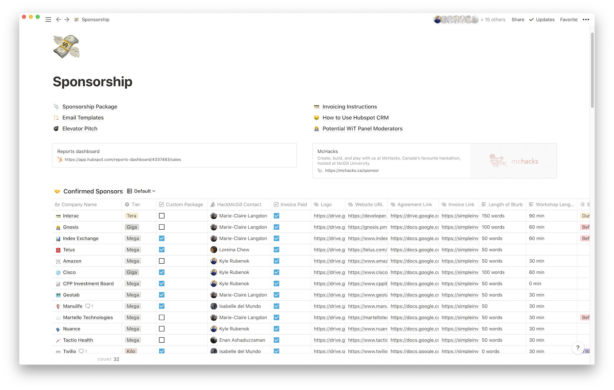

export { future as theme } from 'mdx-deck/themes'

import { Notes, Image, Head, Split } from 'mdx-deck'

<!-- TODO: Add social media embed images and a github cover photo. -->
<!-- TODO: Double spacing for notes? -->

<Head>
    <title>Organizing Organizers</title>
</Head>

# Organizing Organizers
How to project manage your hackathon and organizing team.

---

# About Me 👋
<!-- TODO: Top-Bottom margins and line spacing on this slide. -->
Toronto -> Montreal ❄️

McGill Computer Science (5th Year 😬) 🎓

2017-2019: President, Computer Science Undergraduate Society 🎙

2017-2019: Co-Director, HackMcGill 🐣

2018-Current: Board Member, Students' Society of McGill University 📕

2016 & 2017: Systems Engineering Intern, Cisco 🌐

2018 & 2019: Program Manager Intern, Microsoft ☁️

<Notes>

Beyond my courseload, I've tack on a lot of extra curriculars. Like many of you probably, I find that activities outside of the classroom are more beneficial to my growth than classes.

Because my schedule tends to get cramped pretty quickly, I decided it was important that I focused on being effective with my time to maximize my output while minimizing the time I spend working.

</Notes>

---

# Project Manager
<!-- TODO: Left Right margins on this slide -->

_the practice of initiating, planning, executing, controlling, and closing the work of a team to achieve specific goals and meet specific success criteria at the specified time. The primary challenge of project management is to achieve all of the project goals within the given constraints._

<Notes>

Can someone read this out for me?

That's a lot of words to say you make sure the projet gets done on time and accomplishes the right things. 

</Notes>

---

### Project Manager != Boss

<Notes>

Being a project manager doesn't mean you are the boss. It does mean that you are accountableto the completion of the project and that you work with others to eliminate blockers and makesure the work is efficient and the goals are well communicated and efficient. 

</Notes>

---

### What are we trying to achieve?

<Notes>

When we layout our project to manage, we need to define some goals. We can lay these out as OKR's (objectives and key results). 

Google coined this practise early on and it's something I wish I had done more proactively in my time leading McHacks. 

</Notes>

---

We will _______ as measured by _______.

<Notes>

This is how we typically format an OKR. Note the importance of measuring the goal. 
- Can anyone give me an OKR they'd like to achieve this year with their hackathon?

Great! The McHacks team is broken down into 6 sub teams, somethign I wish we'd done is define a set of OKR's for each team and place them in an area of prominence. 

If nobody thinks of good examples:
- We will improve food service efficiency as measured by meal line up times. 
- We will improve hacker participation as measured by submission rate.

</Notes>

---

<!-- TODO: Fix Left-Right margins on this slide.  -->
<!-- TODO: Find a format for quotes -->
_"Great, so we have our goals, but we’re students and we're super busy. How are we going to get all this done?!?!?"_

<Notes>

I’m glad you brought that up. This is where efficient tooling, systems and critical forethought come into play. 

</Notes>

---

### We build systems!

<Notes>

What do I mean by a system?

A system should be a well understood and documented process for completing recurring tasks. This can range from taking minutes of your team meetings to requesting artwork from the design team to reviewing hacker applications. 

</Notes>

--- 

### That’s great. How?

<Notes>

Well this one is a bit up to you… 

This past year we built a lot of our systems ontop of a tool called Notion along with Slack. I’m going to make some of my examples in Notion, but you could achieve similar results with Google Docs, Office 365, Trello, Airtable, etc….

</Notes>

---

### Skack isn't the whole solution

<Notes>

While Slack has helped people communite much more efficiently in small teams, it is somewhat ephemeral in nature and doesn't work well as a reference for information. We need to create systems that can be easily discovered and parsed. 

</Notes>

---

### What do we want out of a system?
- Consistent
- Transparent
- Discoverable
- Documented

<Notes>

Does anyone have any other attributes they'd like out a system?

</Notes>

---

### Systems create discoverable information.

<Notes>

Making information easily discoverable to the extended team will greatly reduce people waiting on others with blockers. 

This means that when someone has a question instead of waiting until someone has the answers, they are empowered to find the information and continue on in the limited time they have to work on the hackathon. 

</Notes>

--- 

<!-- TODO: Fill in Notion link to sanitized Sponsorship homepage. -->

<Notes>

Switch from deck into Notion and give demonstration of sponsorship homepage from McHacks 6.

</Notes>

---

### What did we just see?

1. Send Cold Emails in Hubspot
2. Confirmed Deals get logged in Notion
3. Collect deliverables from Sponsors and log into Sponsors Table
4. Link to related tables in Workshops, Opening Ceremonies, Etc...
5. Notify relevant parties via Slack automatically with updates.

<Notes>

For McHacks 6, we only logged confirmed Sponsors in our Notion workspace. When we confirmed a sponsor, they were sent a docuemnt we called an "agreement" that instructed them on what to submit and when as "deliverables". 
These deliverables get gathered by the sponsorship team but largely served our other teams like Design, Dev, Experienece and more. Giving them access to the latest information and notifying them automatically helps to empower Organizers to be proactive. 

</Notes> 

--- 

## Activity

---

With two others (_from different events_), design a system to handle a commonly recurring task in hackathon planning.

- What information do you need to collect
- What needs to be done with that information
- How do you collect and store this?
- Who needs to act on this information?
- How do they get notified?
- How are the actions tracked?
- How much of the process can we automate?

*10 Minutes to prepare*

<Notes>

During this time, I should be circulating around the room helping groups work through their systems. 

Some ideas: 
- Design requesta
- Hacker acceptances
- Incoming questions/emails/facebook messages
- Vendor quotes
- Meeting minutes. 

</Notes>

---

## Presentations

---

## Thank you! 

*Stay in touch!*
- [Github/krubenok](https://github.com/krubenok)
- [Twitter/@krubenok](https://twitter.com/krubenok)
- [kyle@rubenok.ca](mailto:kyle@rubenok.ca)
- [mchacks.ca](https://mchacks.ca)
- [blog.rubenok.ca/posts/hackcon-vii](https://blog.rubenok.ca/posts/hackcon-vii)

